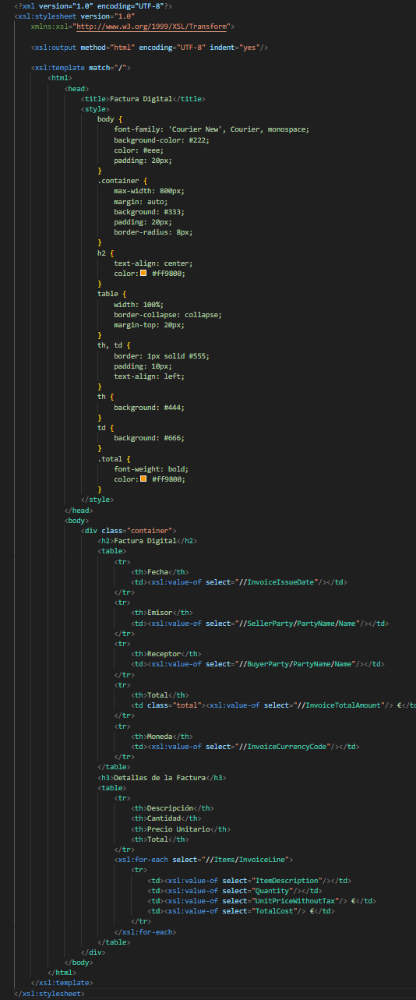
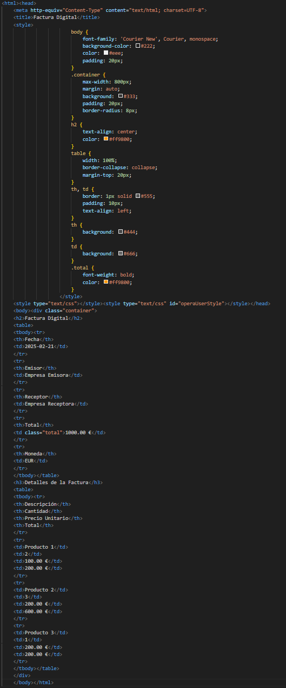
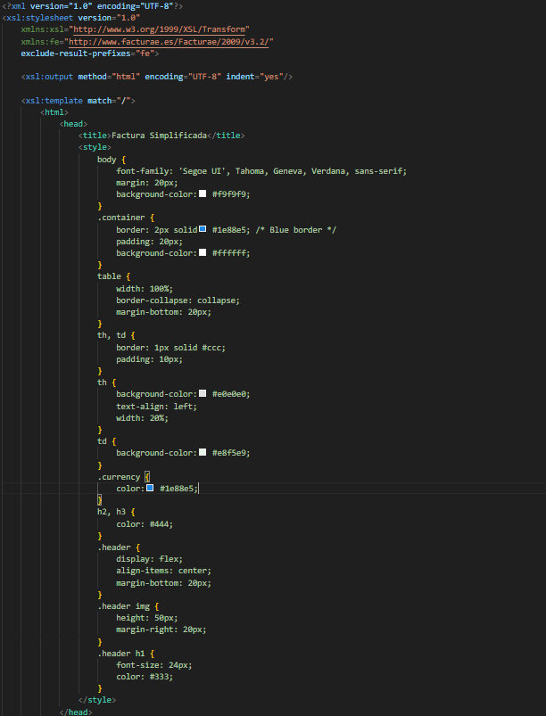
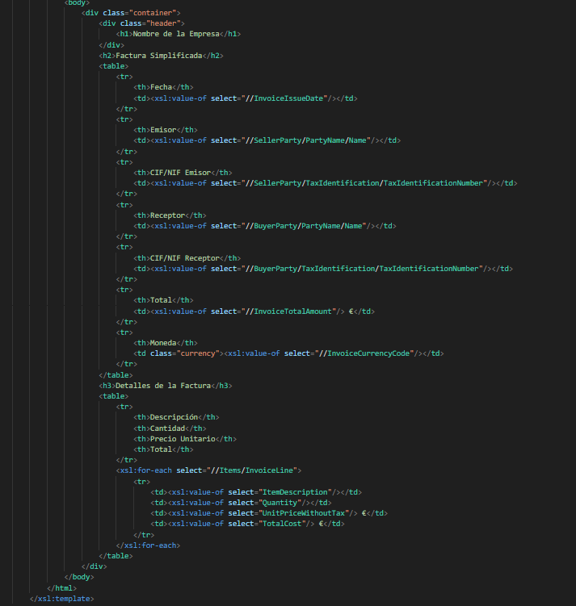
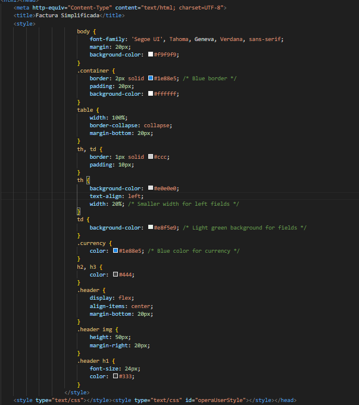
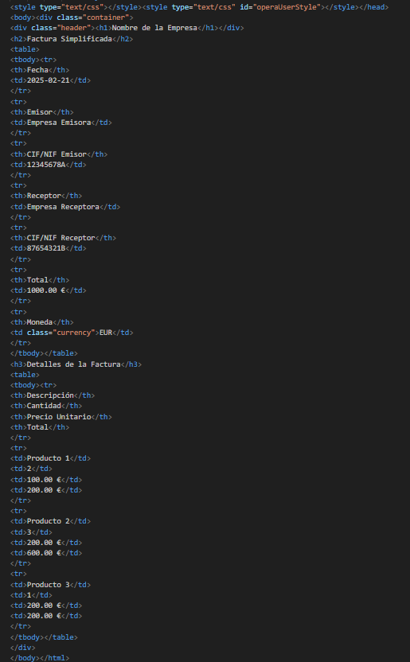

Plantillas XSLT para FacturaE

Este repositorio contiene dos plantillas XSLT diseñadas para transformar archivos XML de facturas en formato FacturaE a documentos HTML fácilmente legibles.

Archivos

facturaxslt1.xslt: Plantilla con un diseño oscuro y moderno.

facturaxslt2.xslt: Plantilla con un diseño claro y más tradicional.

factura.xml: Archivo de ejemplo con datos de una factura.

factura1.html: Resultado de aplicar facturaxslt1.xslt a factura.xml.

factura2.html: Resultado de aplicar facturaxslt2.xslt a factura.xml.

Descripción de las plantillas XSLT

facturaxslt1.xslt

Utiliza una combinación de colores oscuros con fondo negro y detalles en naranja.

Emplea la fuente "Courier New" para un estilo monoespaciado.

Organiza la información en una tabla con bordes grises y encabezados resaltados.

Incluye clases CSS para mejorar la legibilidad y resaltar valores importantes.

facturaxslt2.xslt

Presenta un diseño claro con colores neutros y una fuente más convencional.

Usa un estilo más formal, con una tabla con bordes grises y un fondo blanco.

Estructura la información de manera ordenada con secciones diferenciadas.

Cómo usar las plantillas

Asegúrate de tener un procesador XSLT compatible, como un navegador moderno o herramientas como xsltproc.

Abre el archivo factura.xml en un editor de texto y enlaza la plantilla deseada con:

<?xml-stylesheet type="text/xsl" href="facturaxslt1.xslt"?>

o

<?xml-stylesheet type="text/xsl" href="facturaxslt2.xslt"?>

Abre el archivo XML en un navegador para visualizar la transformación.

Ejemplo de salida

Ambas plantillas generan una página HTML con:

Información del emisor y receptor de la factura.

Fecha y moneda de la transacción.

Detalles de los productos o servicios facturados.

Total de la factura en euros.

Capturas de pantalla

Se incluyen capturas de pantalla del código fuente y de la web resultante:

Capturas de  y 

Capturas de  /  y  / 

Contribuciones

Si deseas mejorar o modificar las plantillas, siéntete libre de hacer un fork del repositorio y enviar un pull request.

Licencia

Este proyecto está bajo la licencia MIT. Puedes usarlo y modificarlo libremente.

